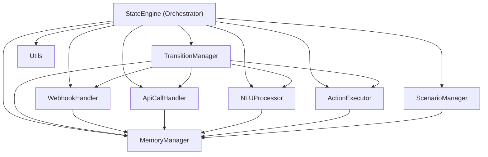

# StateEngine Refactoring Plan

## 1. 리팩토링 구조 요약 (Refactoring Structure Summary)

- **StateEngine**:  
  대화 흐름의 오케스트레이터.  
  각 매니저/핸들러/프로세서를 DI로 받아, 실제 상태 전이와 응답을 조정.

- **ScenarioManager**:  
  시나리오의 로딩, 저장, 조회 등 시나리오 데이터 관리.

- **TransitionManager**:  
  상태 전이, 자동 전이, 조건/인텐트/이벤트 핸들러 관리.

- **WebhookHandler / ApiCallHandler / IntentHandler**:  
  각각 Webhook, API, Intent 관련 처리 담당.  
  공통 인터페이스(BaseHandler)를 상속하여 일관된 방식으로 동작.

- **NLUProcessor**:  
  NLU 결과 파싱, 인텐트/엔티티 추출, 인텐트 매핑.

- **MemoryManager**:  
  세션별 메모리, 엔티티/슬롯 저장, 메모리 액션 등 관리.

- **ActionExecutor**:  
  EntryAction, PromptAction, Reprompt 등 액션 실행.

- **Utils**:  
  템플릿 처리, JSONPath 매핑, 기타 보조 함수.

---

## 2. 설계 의도 (Design Intent)

- **SOLID 원칙 준수**  
  - 각 클래스는 단일 책임만 가지며, 서로 느슨하게 결합
  - 새로운 핸들러/기능 추가 시 기존 코드 수정 최소화 (OCP)
  - 의존성 주입(DI)으로 테스트 및 확장성 강화 (DIP)

- **유지보수성/확장성 향상**  
  - 각 컴포넌트가 독립적으로 테스트/교체/확장 가능
  - 실제 서비스 환경, 테스트 환경, Mock 환경 등 다양한 상황에 유연하게 대응

- **테스트 용이성**  
  - 각 컴포넌트 단위 테스트 가능
  - Mock 객체를 주입하여 StateEngine의 통합 테스트 가능

- **가독성/협업성 강화**  
  - 역할별로 파일/클래스가 분리되어, 신규 개발자도 빠르게 구조 파악 가능

---

## 3. 향후 리팩토링 작업 시 참고사항

- 실제 코드 분리 시, 각 책임별로 함수/로직을 이동
- DI 프레임워크(예: FastAPI Depends, Python의 의존성 주입 라이브러리 등) 활용 가능
- 각 컴포넌트별 단위 테스트 코드 작성 권장

---

## 4. 책임별 파일 구조 예시 (Example File Structure)

```plaintext
backend/services/
  - state_engine.py           # StateEngine: 오케스트레이션/조정자 역할만
  - scenario_manager.py       # 시나리오 로딩/저장/조회 담당
  - transition_manager.py     # 상태 전이 및 핸들러 관리
  - webhook_handler.py        # Webhook 처리 담당
  - apicall_handler.py        # API Call 처리 담당
  - nlu_processor.py          # NLU 결과 파싱 및 인텐트/엔티티 추출
  - memory_manager.py         # 세션/엔티티/슬롯 메모리 관리
  - action_executor.py        # Entry/Prompt/Reprompt 등 액션 실행
  - utils.py                  # 템플릿, JSONPath 등 공통 유틸리티
```

---

## 5. 컴포넌트 간 데이터/의존성 흐름 다이어그램 (Data/Dependency Flow Diagram)



---

## 6. 단계별 To-Do List

1. 현재 코드에서 각 기능별 책임(시나리오, 전이, 핸들러, NLU, 메모리 등) 도출 및 목록화
2. 각 책임별로 클래스를 설계하고, 파일 구조를 정의
3. 핸들러(웹훅, API, Intent 등) 공통 인터페이스/추상클래스 설계
4. StateEngine이 각 핸들러를 DI로 주입받도록 설계
5. 각 컴포넌트 간 데이터/의존성 흐름 다이어그램 작성
6. 리팩토링 구조와 설계 의도 문서화 